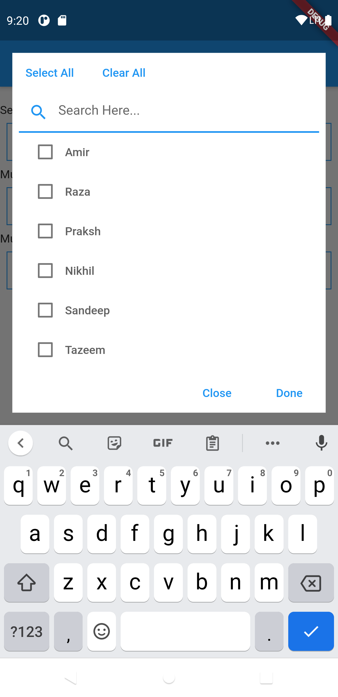
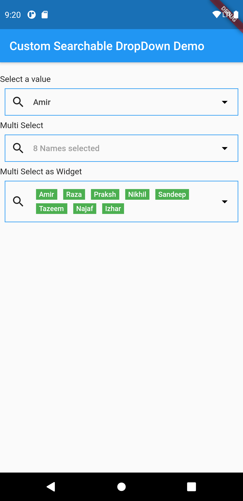

# custom_searchable_dropdown

Widget allows user to search from a dynamic list of data you can customise the dropdown according to your need,it can also be customised as multiple select or single select. The on change event reurn the complete list from index which option is selected.

## Platforms

This widget has been successfully tested on iOS, Android and Chrome.

## Examples

The Example will help you to know how it works.

### Gallery

See code below.

| Example name | Image |
| --- | --- |
| [All DropDown](#All-DropDown) |  |
| [MultiSelect DropDown](#MultiSelect-DropDown) |  |

### Code

#### Plugin usage

Add to your `pubspec.yaml` in the `dependencies` section:
```
  custom_searchable_dropdown:
```

Get packages with command:
```
flutter packages get
```

Import:
```dart
import 'package:custom_searchable_dropdown/custom_searchable_dropdown.dart';
```

#### Single Select
```dart
     customSearchableDropDown(
                     items: listToSearch,
                     label: 'Select Name',
                     decoration: BoxDecoration(
                         border: Border.all(
                             color: Colors.blue
                         )
                     ),
                     prefixIcon:  Padding(
                       padding: const EdgeInsets.all(0.0),
                       child: Icon(Icons.search),
                     ),
                     dropDownMenuItems: listToSearch?.map((item) {
                       return item['name'];
                     })?.toList() ??
                         [],
                     onChanged: (value){
                       if(value!=null)
                       {
                         selected = value['class'].toString();
                       }
                       else{
                         selected=null;
                       }
                     },
                   ),
```
#### Multi Select
```dart
      customSearchableDropDown(
                      items: listToSearch,
                      label: 'Select Name',
                      multiSelectTag: 'Names',
                      decoration: BoxDecoration(
                          border: Border.all(
                              color: Colors.blue
                          )
                      ),
                      multiSelect: true,
                      prefixIcon:  Padding(
                        padding: const EdgeInsets.all(0.0),
                        child: Icon(Icons.search),
                      ),
                      dropDownMenuItems: listToSearch?.map((item) {
                        return item['name'];
                      })?.toList() ??
                          [],
                      onChanged: (value){
                        if(value!=null)
                        {
                          selectedList = jsonDecode(value);
                        }
                        else{
                          selectedList.clear();
                        }
                      },
                    ),
```

#### Multi Select as Widget
```dart
      customSearchableDropDown(
                      items: listToSearch,
                      label: 'Select Name',
                      multiSelectTag: 'Names',
                      multiSelectValuesAsWidget: true,
                      decoration: BoxDecoration(
                        border: Border.all(
                          color: Colors.blue
                        )
                      ),
                      multiSelect: true,
                      prefixIcon:  Padding(
                        padding: const EdgeInsets.all(0.0),
                        child: Icon(Icons.search),
                      ),
                      dropDownMenuItems: listToSearch?.map((item) {
                        return item['name'];
                      })?.toList() ??
                          [],
                      onChanged: (value){
                        if(value!=null)
                        {
                          selectedList = jsonDecode(value);
                        }
                        else{
                          selectedList.clear();
                        }
                      },
                    ),